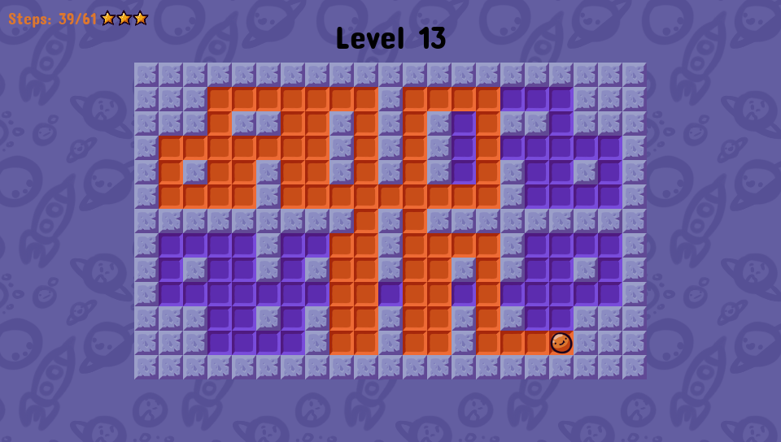

# Pingo

Pingo is a puzzle game in which your goal is to paint the whole level in as little steps as possible.
Try to earn all 3 stars in 30 hand crafted levels!

All this gorgeous art was done by Jumbocube.

[RobDevs made a level editor](https://github.com/robDevs/pingo-edit) for this game, it was a massive help during development and it will be released along with custom level support in the future

# Screenshots

# Controls
* Use the DPAD to navigate the menus and the game
* Use CROSS (X) to choose menu option and CIRCLE to go back in menus 
* Press START to pause the game

# Releases
[Get the latest release here](https://github.com/Grzybojad/Pingo/releases)

# To Do
Here are some of the planned features:
* more levels with unique gameplay elements like new tiles with special effects
* visual improvements
* better SFX, music
* custom level support
* in game level editor 
