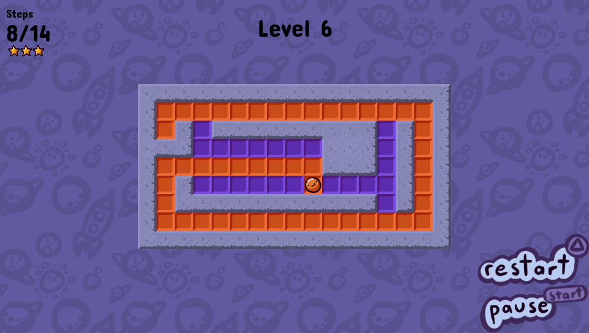

# Releases
[Download the latest version here.](https://github.com/Grzybojad/Pingo/releases)

# Pingo
Pingo is a puzzle game in which your goal is to paint the whole level in as little steps as possible.
Try to earn all 3 stars in 60 hand crafted levels!

All art was done by [Jumbocube](https://twitter.com/Jumbocube1).

[RobDevs made a level editor](https://github.com/robDevs/pingo-edit) that was used during development. You can use it yourself to easily create your own Pingo levels.
[Here's the tutorial](https://github.com/Grzybojad/Pingo/README_custom_levels.md) on how to use it.

# Screenshots

# Controls
* Use the DPAD to navigate the menus and the game
* Use CROSS (X) to choose menu option and CIRCLE to go back in menus 
* Press TRIANGLE to quickly restart the level
* Press START to pause the game
