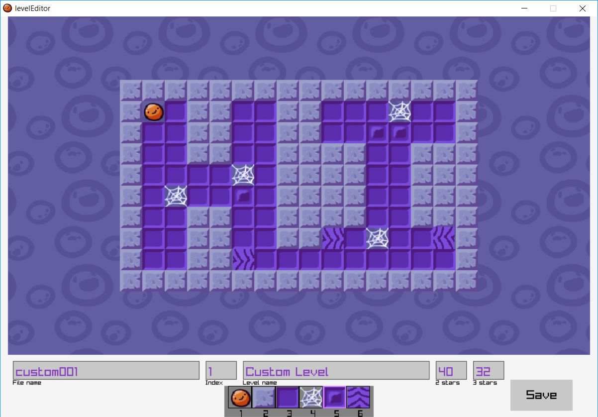

# Custom Levels
You can use [pingo-edit](https://github.com/robDevs/pingo-edit) to create your own Pingo levels.

Select the tiles from the menu and place them on the map with the left mouse button.
You can resize the level using the arrow keys.

Build the level with these requirements in mind:
- 1 spawn tile
- Surround the level with wall tiles, to prevent the player from falling off the map
- Don't make levels that the player can get stuck in
- Make sure it's actually possible to finish the level

Once you're done, fill out all the text fields:
- File name: The name of the level file. My advice is to name them something like "custom001", "custom002", because the levels are sorted in an alphabetical order.
- Index: The number that shows up on the level door on the Level Select screen in game.
- Level name: The name displayed in game
- 2 stars: The maximum numbers of steps a player can make to get 2 stars
- 3 stars: The maximum numbers of steps a player can make to get 3 stars  

The "Index", "2 stars" and "3 stars" need to be whole numbers. If you input anything else, the game will crash.
For the "Level name" you can use all basic ASCII symbols other than '<' and '>'.

"3 stars" should be the minimal amount of steps it takes to finish a level. "2 stars" should be around 10 steps more than "3 stars", depending on the size of the level.

Save the file and it will appear in the pingo-edit directory under the name "\<File name\>.txt".

You can now copy it to ux0:/data/Pingo/levels on your Vita. Boot up Pingo, go to Level Select -> Custom Levels and you should see your level there.
Test it out, make corrections, have fun and share it with others! I'd love to see what you come up with.